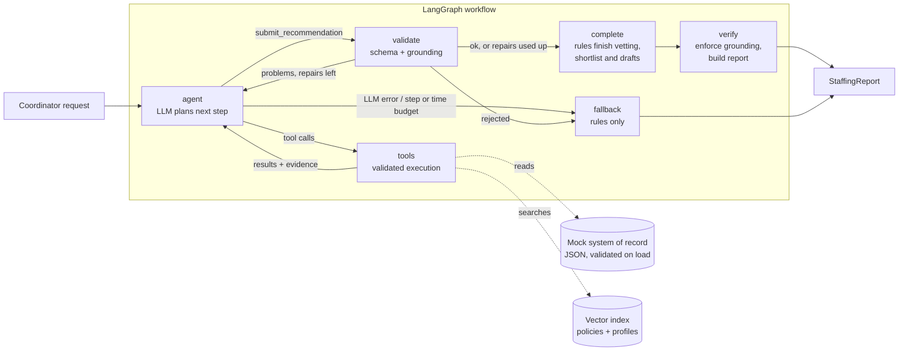

# Shift Fill Assistant

An AI workflow assistant for the operations team of a healthcare staffing platform. A coordinator
types a request such as *"Find two ICU nurses for the St. Mary's night shift on October 14 and
draft outreach"*, and the assistant:

1. Resolves the request to one open shift, or asks a clarifying question.
2. Retrieves the facility's policies (RAG) for unit preferences and rules.
3. Finds candidates with semantic search over clinician profiles.
4. Vets every clinician in the shift's pool with a deterministic eligibility engine: license and
   jurisdiction, certifications valid through the shift, experience, double booking and rest.
5. Ranks the eligible clinicians, explains each choice from recorded facts with policy
   citations, and drafts outreach for a human to review. Nothing is sent.
6. Verifies the answer against the evidence the tools returned, finishes any mandatory work the
   model skipped with deterministic rules, and labels what code added.

> Senior AI Engineer take-home for Florence Healthcare, by
> [Aibek Rysbek](https://github.com/aibek-r).
> Stack: Python 3.11+ (tested on 3.13), LangGraph, OpenAI (`gpt-5.4-mini`), fastembed, Pydantic,
> Streamlit 1.64.

## Quick start

```bash
python -m venv .venv
.venv\Scripts\activate            # macOS/Linux: source .venv/bin/activate
pip install -e ".[dev]"
cp .env.example .env              # then set OPENAI_API_KEY

streamlit run app/streamlit_app.py                     # web UI
shift-assistant "Find two ICU nurses for the St. Mary's night shift on Oct 14"   # CLI
pytest                                                 # offline tests, no API key needed
python -m evals.run                                    # offline evaluation harness
```

**Agent mode needs your own OpenAI API key.** Without one, the app runs in rule-based fallback
mode: the same eligibility engine and templates, with the shift matched to the request by rules.
`examples/` contains saved runs from the live model, plus one rule-based run;
[examples/README.md](examples/README.md) explains which ones predate the latest changes.

The first run downloads a small local embedding model (about 70 MB) into `.cache/`. If that
fails, search falls back to keyword matching, and the UI and CLI say so. `.env.example` pins
`REFERENCE_DATE` so relative dates match the October 2026 mock shifts. Start Streamlit from this
directory so it loads the theme in `.streamlit/config.toml`. The CLI also accepts `--shift`,
`--facility`, `--unit` and `--date`, which override the request text.

Docker is optional and **was not verified** in the latest environment (the Docker daemon was
not running):
`docker build -t shift-fill-assistant . && docker run -p 8501:8501 --env-file .env shift-fill-assistant`

## Architecture



| Layer | Module | Responsibility |
| --- | --- | --- |
| Domain | `domain/` | Typed entities, structured shift preferences, and the **deterministic eligibility engine** |
| Data | `repository.py` | Loads and validates the JSON "system of record", including referential integrity |
| Retrieval | `retrieval/` | fastembed embeddings, a cosine vector index with metadata pre-filtering, policy chunking |
| Tools | `tools/` | Five tools with Pydantic argument schemas, plus a registry that never raises |
| Agent | `agent/` | LangGraph state machine, prompts, the structured submission, model budget and retries |
| Reliability | `reliability/` | Grounding checks, deterministic completion, verifier, status rules, fallback shift resolution, rule-based fallback |
| Interfaces | `app/streamlit_app.py`, `cli.py` | Streamlit UI with live progress, review and a trace; CLI printing Markdown or JSON |
| Evaluation | `evals/` | Offline evaluation harness (`python -m evals.run`) |

## How the assignment requirements are met

| Requirement | Implementation |
| --- | --- |
| **Agent workflow:** multi-step reasoning, tool calling, context management | A LangGraph ReAct loop with typed state. The model chooses tools (parallel calls allowed) and must finish through a validated `submit_recommendation` call (`tool_choice="required"`). Validation, deterministic completion and verification follow as graph steps. |
| **Tools** (at least 2-3) | `find_open_shifts`, `search_facility_policies`, `search_clinicians`, `evaluate_candidates`, `draft_outreach`, plus the submit tool. All data is mocked. |
| **Retrieval and context engineering** | RAG over facility handbooks (one chunk per `##` section, citation IDs such as `FAC-001#icu-unit-profile`); local `bge-small` embeddings; retrieval filtered to the facility and global policies; contact and license fields kept out of the model's context; a run-scoped `EvidenceLedger` as working memory; size-capped tool output that stays valid JSON. |
| **Structured outputs** | The final answer is a Pydantic `AgentSubmission`. The public output is a typed `StaffingReport` with recommendations and their provenance, alternates, exclusions with reason codes, coverage counts, a completion record, issues, a trace and metrics. |
| **Reliability** | Validation everywhere, grounding checks with self-repair, deterministic completion, a bounded model budget with retries, a rule-based fallback, and an offline evaluation harness. See below. |

## Reliability at a glance

Code renders recorded facts and decides compliance; the model plans and ranks. Details and
trade-offs are in [docs/design.md](docs/design.md).

- **Eligibility is deterministic.** `EligibilityEngine` makes every verdict, and the model
  cannot override it. Ineligible clinicians never reach recommendations or outreach.
- **Every reference is grounded.** Shifts, clinicians, citations and drafts must exist in the
  run's evidence. Problems go back to the model as repair feedback, up to
  `MAX_REPAIR_ATTEMPTS`, and are enforced by the verifier afterwards. Displayed explanations,
  warnings and outreach facts come from records, never from model prose.
- **Status follows completed work.** A status only rules something out once the relevant work
  is done (full table in [design.md](docs/design.md#report-status-and-completion-conditions)):

  | Status | Meaning |
  | --- | --- |
  | `ready` | Whole pool vetted, requested shortlist reached, requested drafts present |
  | `partial` | Whole pool vetted, but fewer eligible (or allowed) clinicians than requested |
  | `no_eligible_candidates` | Whole pool vetted, nobody eligible |
  | `needs_review` | Mandatory work unresolved; verified recommendations are kept |
  | `needs_clarification` | The request does not identify one shift |
  | `failed` | No usable answer |

- **Deterministic completion with provenance.** After validation, code vets pool members the
  model skipped (computing the pool if it never searched), fills a short shortlist in rule order
  after the model's own valid picks, and drafts missing outreach when it was requested. Each
  recommendation records `selected_by` and `outreach_by` (`model` or `code`), and the report
  lists what code completed.
- **Model execution budget.** One monotonic deadline (`MAX_RUN_SECONDS`) covers every model call,
  retry and backoff. SDK retries are off; rate limits, timeouts and selected 5xx errors are
  retried with backoff that never crosses the deadline; late answers are discarded. It is not a
  total-workflow deadline: completion and fallback may run afterwards.
- **Rule-based fallback.** If the model is missing, fails or exceeds a budget, the fallback
  applies the same engine and templates. Without a selected shift it resolves the facility, unit
  and date from typed fields or conservative text parsing, and asks when several shifts or none
  match.
- **Privacy and human review.** No contact details, license numbers or pay rates in drafts; each
  draft names only its recipient; personal notes are free text but pass deterministic content
  rules (a guardrail, not a guarantee: human approval stays the final check); editing withdraws
  approval; delivery is simulated, and nothing is ever reported as sent.
- **Prompt-injection hygiene.** Tool data is treated as data. One mock profile contains an
  injection attempt; its clinician is ineligible, and a scripted model that obeys it is
  overruled by the verifier (an evaluation case, not a general guarantee).

## Example workflows

Generated by `python scripts/run_examples.py`. Each has a readable `.md` and a full `.json`.
Examples 01-05 are live-model runs recorded before the latest changes and need regeneration to
show current behavior; 06 was regenerated offline from the current code.

| Example | Demonstrates | Result |
| --- | --- | --- |
| [01-icu-night-shift](examples/01-icu-night-shift.md) | Full ReAct loop, RAG citations, six exclusions with reason codes, an eligible alternate | `ready` (agent) |
| [02-picu-shortlist-with-warning](examples/02-picu-shortlist-with-warning.md) | Expiring-credential warning carried into the explanation and the outreach | `ready` (agent) |
| [03-ambiguous-request](examples/03-ambiguous-request.md) | Clarification instead of guessing | `needs_clarification` (agent) |
| [04-unknown-facility](examples/04-unknown-facility.md) | Tool error turned into a clarifying question | `needs_clarification` (agent) |
| [05-no-eligible-candidates](examples/05-no-eligible-candidates.md) | A verified "nobody qualifies" answer with reasons | `no_eligible_candidates` (agent) |
| [06-llm-outage-fallback](examples/06-llm-outage-fallback.md) | Simulated outage; every recommendation labelled as produced by rules | `ready` (fallback) |

The saved live runs took 2-5 LLM calls each. Repair, enforcement, completion, `needs_review` and
budget exhaustion cannot be triggered on demand with a live model; the tests and the evaluation
harness cover them. [docs/DEMO.md](docs/DEMO.md) is a five-minute demo guide.

## Testing and evaluation

```bash
pytest                                               # 276 offline tests
python -m evals.run                                  # 10 cases x (scripted agent, fallback)
ruff check src app scripts tests evals
ruff format --check src app scripts tests evals
mypy --strict src app scripts tests evals
```

Tests run offline with a scripted chat model and a hashing embedder, including headless
Streamlit interactions. They prove the workflow's control flow and safeguards, not the live
model's judgement. The evaluation harness scores status, shift resolution, full-pool
eligibility, accepted rankings, outreach, privacy, grounding issues, repairs, completion,
fallback rate and latency, and writes `evals/results/<timestamp>.md`. Token usage is reported as
unavailable when no model call reported it. See [docs/validation.md](docs/validation.md).

## Configuration

All settings live in `config.py` and can be overridden through environment variables or `.env`.

| Variable | Default | Purpose |
| --- | --- | --- |
| `OPENAI_API_KEY` | none | Enables the agent. Without it, the fallback mode runs. |
| `OPENAI_MODEL` | `gpt-5.4-mini` | Any tool-calling OpenAI model |
| `OPENAI_REASONING_EFFORT` | `low` | Set `none` for non-reasoning models such as `gpt-4.1-mini` |
| `MAX_AGENT_STEPS` / `MAX_REPAIR_ATTEMPTS` | `12` / `2` | Loop budgets |
| `MAX_RUN_SECONDS` | `180` | Model execution budget: one deadline for every model call, retry and backoff (not a total-workflow deadline) |
| `LLM_TIMEOUT_SECONDS` / `LLM_MAX_RETRIES` | `60` / `3` | Per-call timeout (shortened to the budget left) and retries for transient errors; SDK retries are disabled |
| `MAX_RECOMMENDATIONS` | `5` | Upper bound on the shortlist |
| `RETRIEVAL_MIN_SCORE` | `0.5` | Policy relevance cut-off for the embedding model (keyword fallback uses `0`) |
| `EXPIRY_WARNING_DAYS` | `30` | Window for the credential-expiring warning |
| `REFERENCE_DATE` | today (`2026-10-02` in `.env.example`) | Pins "today". The mock shifts are in October 2026. |

## Mock data

`data/` holds 3 facilities, 7 open shifts, 20 clinicians, 3 existing bookings and 4 policy
handbooks. Each clinician exercises a specific rule: an ACLS certificate that expires before
the shift, a California-only license at a Texas facility, a compact license at a facility that
rejects compact licenses, a double booking, too little rest, an inactive profile, and a
certificate expiring within 30 days (a warning, not a blocker). Shift preferences are structured
fields transcribed from each profile.

## Known limitations

- The current code has not been run against the live model: completion rates, ranking under
  the new rubric and real retry behavior are unmeasured. The saved agent examples predate it.
- Scripted tests and evaluations validate orchestration and safeguards, not live reasoning or
  real retrieval quality.
- Text parsing for counts, outreach intent, facility, unit and dates handles common phrasing
  only; typed request fields cover the rest.
- The model budget cannot interrupt a call in flight, so it is not a strict wall-clock limit.
- Mock data only; no authentication, persistent audit trail, PII redaction of free-text
  profiles, or real message delivery. Docker was not verified here.

More in [docs/design.md](docs/design.md#known-limitations-and-defects).

## Next steps

- Regenerate the examples and run `python -m evals.run --live` to measure live completion and
  ranking rates against the offline baseline.
- Move from the brute-force index to pgvector with hybrid BM25 plus vector search at scale.
- Add real data sources behind the repository interface, persisted audit records, tracing,
  authentication, and a HIPAA and PII review of what reaches the model provider.
- Keep conversation state with a LangGraph checkpointer so a coordinator can answer a clarifying
  question in the same thread.
- Connect approved drafts to a real messaging channel, recording who approved and sent what.
