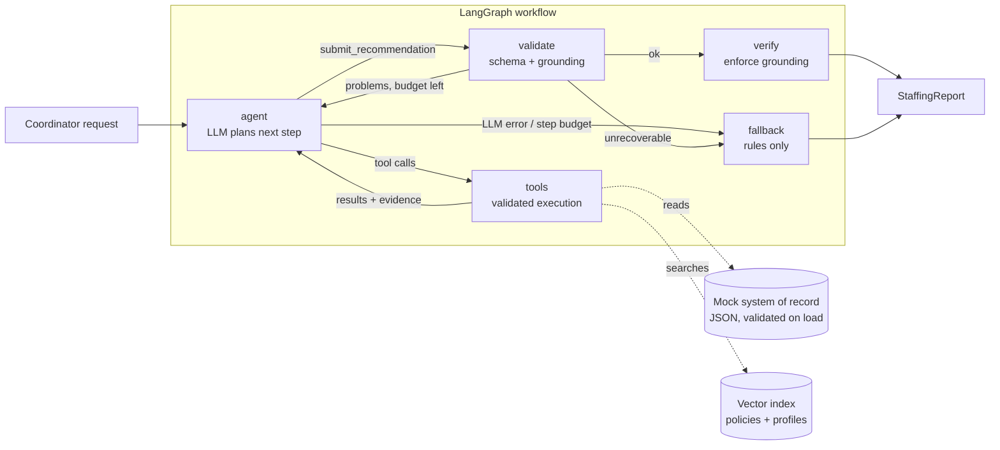

# Shift Fill Assistant

An AI workflow assistant for the operations team of a healthcare staffing platform. A coordinator
types a request such as *"Find two ICU nurses for the St. Mary's night shift on October 14 and draft outreach"*. The assistant then works through these steps:

1. Resolves the request to a concrete open shift, or asks a clarifying question.
2. Retrieves the facility's policies (RAG) to learn unit preferences and rules.
3. Finds candidate clinicians with semantic search over their profiles.
4. Vets every candidate with a deterministic compliance engine. The engine checks license, jurisdiction, certifications valid through the shift, experience, double-booking and rest time.
5. Ranks the eligible clinicians, explains each choice with citations, and drafts outreach for a human to review.
6. Verifies the answer against the evidence the tools returned before showing it.

> Senior AI Engineer take-home for Florence Healthcare, by
> [Aibek Rysbek](https://github.com/aibek-r).
> Stack: Python 3.11+ (tested on 3.13), LangGraph, OpenAI (`gpt-5.4-mini`), fastembed, Pydantic,
> Streamlit 1.64.

## Quick start

```bash
python -m venv .venv
.venv\Scripts\activate            # macOS/Linux: source .venv/bin/activate
pip install -e ".[dev]"
cp .env.example .env              # then set OPENAI_API_KEY

streamlit run app/streamlit_app.py                     # web UI
shift-assistant "Find two ICU nurses for the St. Mary's night shift on Oct 14"   # CLI
pytest                                                 # offline tests, no API key needed
```

The first run downloads a small local embedding model of about 70 MB into `.cache/`. If that
download fails, search falls back to keyword matching and the UI and CLI say so. Without an API
key, the app still runs in deterministic fallback mode. `.env.example` pins `REFERENCE_DATE` so
relative dates match the October 2026 mock shifts.

Docker is optional, and the Dockerfile has not been verified in the final environment:
`docker build -t shift-fill-assistant . && docker run -p 8501:8501 --env-file .env shift-fill-assistant`

The UI uses a teal theme, a local calendar/checkmark logo, an illustrated empty state and
initials avatars. The request and results sit in a centered, responsive workspace. When a
clarifying question offers known facilities, facility cards update the request for review
without making another model call. Selecting an example clears a previously pinned shift.
Theme settings live in `.streamlit/config.toml`; start Streamlit from this project directory
to load them. The SVG assets are local and require no external image service.

## Architecture



| Layer | Module | Responsibility |
| --- | --- | --- |
| Domain | `domain/models.py`, `domain/eligibility.py` | Typed entities and the **deterministic compliance engine** |
| Data | `repository.py` | Loads and validates the JSON "system of record", including referential integrity |
| Retrieval | `retrieval/` | fastembed embeddings, a cosine vector index with metadata pre-filtering, policy chunking |
| Tools | `tools/` | Five tools with Pydantic argument schemas, plus a registry that never raises |
| Agent | `agent/` | LangGraph state machine, prompts, the structured submission schema |
| Reliability | `reliability/` | Grounding checker, verifier, deterministic fallback |
| Interfaces | `app/streamlit_app.py`, `cli.py` | Streamlit UI with live progress and a trace under Technical details, and a CLI that prints Markdown or JSON |

## How the requirements are met

| Requirement | Implementation |
| --- | --- |
| **Agent workflow** with multi-step reasoning, tool calling and context management | A LangGraph ReAct loop (`agent` and `tools` nodes) with typed state. The model chooses tools, with parallel calls allowed. The workflow ends only through a validated `submit_recommendation` tool call, enforced by `tool_choice="required"`. |
| **Tools** (at least 2 or 3) | `find_open_shifts`, `search_facility_policies`, `search_clinicians`, `evaluate_candidates` and `draft_outreach`, plus the submit tool. All data is mocked. |
| **Retrieval and context engineering** | **RAG** over facility handbooks, one chunk per `##` section, with stable citation IDs such as `FAC-001#icu-unit-profile`. **Embeddings and vector search** use local `bge-small` via fastembed. **Context filtering** limits retrieval to the facility and global policies. **PII minimisation** omits structured contact and license-number fields; free text still needs production redaction. **Memory and state** use a run-scoped `EvidenceLedger`. Size-capped tool output drops whole list items and retains valid JSON with a `truncated` note. |
| **Structured outputs** | The final answer is a Pydantic `AgentSubmission` passed as tool arguments. The public output is a typed `StaffingReport` with recommendations, alternates, exclusions with reason codes, candidate coverage counts, issues, trace and metrics. Code writes the summary from the verified lists, so counts never contradict them. |
| **Reliability** | See the next section. |

## Reliability and hallucination mitigation

The core principle is that **code renders recorded facts and decides compliance, and the model
plans the workflow and ranks eligible clinicians**.

- **Deterministic compliance.** `EligibilityEngine` makes every eligibility verdict. The model
  cannot overrule it. `draft_outreach` refuses ineligible clinicians, and the verifier drops any
  ineligible clinician who reaches the answer.
- **Facts from the record.** Explanations and outreach show recorded experience, a matching
  structured shift preference (or explicit openness to the offered period), shift times and
  credential warnings. Preferences are labelled as self-reported, never quoted from profile free
  text, and never affect eligibility.
  The model and coordinator select 1-3 approved friendly sentences for the personal note; the
  editor displays the options. Arbitrary factual edits are rejected, including pay written in
  words, arrival instructions, other clinicians and invented qualifications. This deliberately
  limits free-text editing; it does not attempt to prove arbitrary prose with regex checks.
- **Request intent.** Common explicit phrases such as "find two nurses", "shortlist of four"
  and "do not draft outreach" populate typed `requested_count` and `draft_outreach` fields.
  API callers can set those fields explicitly for other wording. Both the agent and fallback
  honor them. `ready` means the requested shortlist is complete, independently of open positions;
  the summary reports both. A shortage or configured recommendation limit remains `partial`.
  The pinned shift is enforced during tool execution and final verification.
  Common relative dates (today, tomorrow, this week and next week) are checked against
  `REFERENCE_DATE`, or today's date when unset. Calendar weeks run Monday through Sunday;
  shifts outside the requested period require clarification in both agent and fallback modes.
- **Grounding checks with self-repair.** On submission, `check_grounding` confirms that each
  reference came from this run's evidence. The shift, every clinician (vetted and eligible),
  every citation and every draft must be there, and citations must belong to the shift's facility
  or the organisation-wide policies. It also confirms that the candidate pool was searched and
  every clinician in it was vetted, and that each rationale mentions the clinician's credential
  warnings. Problems go back to the model as a tool error, and it gets up to
  `MAX_REPAIR_ATTEMPTS` tries to fix them.
- **What is verified.** References, eligibility, requested shortlist size and coverage are checked
  by code. Unverified model rationales and summary notes are not displayed or exported; factual
  candidate explanations are rebuilt from evaluation evidence. Policy citations show retrieved
  facility context, rather than establishing arbitrary prose claims. For supported relative
  dates, code builds the clarification question from recorded shifts and labels dates outside
  the requested period as alternatives. Other clarification questions remain model-written.
- **Enforcement.** If repairs run out, the verifier strips whatever is ungrounded and records each
  removal as an issue in the report. Names, warnings, citation text and drafts in the report always
  come from the ledger, never from model text.
- **Validation everywhere.** Data files, tool arguments, the submission and the request are all
  Pydantic models. Bad tool arguments, unknown IDs and malformed JSON become readable errors that
  the model can recover from. Unexpected tool exceptions are logged and contained without leaking
  internals.
- **Retries and fallback.** SDK retries are disabled; the workflow retries rate limits,
  timeouts and selected 5xx errors itself, with backoff, inside one model execution budget
  (`MAX_RUN_SECONDS`). Answers that arrive after the deadline are discarded. If the LLM still
  fails, is missing, or exceeds `MAX_AGENT_STEPS` or the budget, the graph routes to a
  **deterministic fallback**. It uses the same engine
  and templates and labels the report `mode: fallback`. Without a selected shift it resolves the
  facility, unit and date from typed request fields or conservative text parsing, and asks when
  several shifts or none match (see [docs/design.md](docs/design.md)). It uses the requested
  shortlist size, or open positions when unspecified, and honors requests without outreach. The
  UI can simulate an outage to show this.
- **Degraded retrieval is visible.** If the embedding model cannot load, keyword matching takes
  over with a relevance cut-off suited to it, and the UI and CLI show a warning. Missing or empty
  facility/global policy documents add a visible `POLICY_CONTEXT_MISSING` report issue in both
  modes; tool results also warn when no relevant excerpts are retrieved.
- **Review and export.** JSON downloads contain saved outreach edits plus the run ID and each
  draft's current `pending`, `editing` or `approved` status. Unsaved or rejected text is never
  exported. Editing withdraws approval, and invalid requests or changes to the selected shift
  or outage control clear earlier reports and approvals.
- **Prompt-injection hygiene.** The prompt says tool data is data, not instructions. One mock
  profile, Aisha Rahman, contains an injection attempt. She is ineligible anyway, and the verifier
  would drop her even if the model complied.
- **Auditability.** Every LLM call, tool call, validation and verification step is recorded as a
  trace event with its timing and tokens. The trace appears under Technical details in the UI and is saved in the report.

## Example workflows

These were generated by `python scripts/run_examples.py` against the live model. Each has a
readable `.md` and a full `.json` report.

| Example | Demonstrates | Result |
| --- | --- | --- |
| [01-icu-night-shift](examples/01-icu-night-shift.md) | Full ReAct loop, RAG citations, six exclusions with reason codes, an eligible alternate | `ready`. Maria Santos and Grace Liu recommended, Daniel Kim kept as an alternate |
| [02-picu-shortlist-with-warning](examples/02-picu-shortlist-with-warning.md) | Expiring-credential warning carried into the rationale and the outreach | `ready`, with Liam Chen's PALS flagged |
| [03-ambiguous-request](examples/03-ambiguous-request.md) | Clarification instead of guessing | `needs_clarification` |
| [04-unknown-facility](examples/04-unknown-facility.md) | Tool error turned into a helpful question | `needs_clarification` |
| [05-no-eligible-candidates](examples/05-no-eligible-candidates.md) | Honest "nobody qualifies" answer, with reasons | `no_eligible_candidates` |
| [06-llm-outage-fallback](examples/06-llm-outage-fallback.md) | Simulated LLM outage, rules-only report | `ready` (`mode: fallback`) |

A typical full run takes about 5 LLM calls, 14k tokens and 15 seconds. Hallucination repair and
enforcement cannot be triggered on demand with a live model, so they are shown by the scripted
tests below.

## Testing

`pytest` runs 125 tests offline, including headless Streamlit interactions. They use a hashing embedder and a scripted
chat model, so they prove the workflow's control flow and safeguards, not the live model's
judgement.

- **Eligibility.** Every blocker type, warnings, and the boundary where a credential expires on
  the shift's last day.
- **Retrieval.** Chunk IDs, ranking, proof that a facility's search never returns another
  facility's policies, and the keyword fallback when the embedding model cannot load.
- **Tools.** Structured contact fields are omitted. Errors are readable. Exceptions are contained. Outreach for
  ineligible clinicians and notes with pay rates are refused. Oversized output stays valid JSON.
- **Workflow.** The happy path. A hallucinated candidate sent back for repair. Ungrounded content
  stripped once repairs run out. Incomplete vetting and an unsearched pool caught, including a
  "no eligible" claim after checking one clinician. Another facility's citation dropped. A
  rationale that omits a credential warning sent back. An unparseable answer, an LLM outage, a
  missing key, and step- and time-budget overruns all degrading to the fallback, including after
  the agent narrowed several shifts down to one. Malformed tool-call JSON and an early submit
  reported back to the model.
- **Reporting.** Summary counts always match the report lists, are rebuilt after verification
  removes a recommendation, and never claim full coverage unless it was confirmed.
- **Outreach review.** Edited notes are revalidated, keep the verified shift details, and editing
  an approved message withdraws the approval. JSON exports match saved edits and approval state.
  Invalid submissions and shift/mode changes clear stale results; reopening the editor restores
  saved text rather than a rejected edit. Approvals never carry over to a new run.
- **Review regressions.** PICU shortlists of two, one requested clinician for two open positions,
  shortlists larger than the eligible pool, size limits, cross-shift tool calls and submissions,
  unsupported factual model text, negated/conditional preferences, missing policy files and
  unsupported generated or edited notes.
- **Preferences.** Structured fields only; a conflicting preference is never presented as support.

Ranking quality and the rate of grounding problems still need live evaluation. The example
reports were regenerated after these fixes using the paid model and real local embeddings;
the outage example uses the deterministic fallback.

`ruff check`, `ruff format --check` and `mypy --strict` all pass on `src/`, `app/`, `scripts/`
and `tests/`.

## Configuration

All settings live in `config.py` and can be overridden through environment variables or `.env`.

| Variable | Default | Purpose |
| --- | --- | --- |
| `OPENAI_API_KEY` | none | Enables the agent. Without it, the fallback mode runs. |
| `OPENAI_MODEL` | `gpt-5.4-mini` | Any tool-calling OpenAI model |
| `OPENAI_REASONING_EFFORT` | `low` | Set `none` for non-reasoning models such as `gpt-4.1-mini` |
| `MAX_AGENT_STEPS` / `MAX_REPAIR_ATTEMPTS` | `12` / `2` | Loop budgets |
| `MAX_RUN_SECONDS` | `180` | Model execution budget: one deadline for every model call, retry and backoff. Not a total-workflow deadline; completion and fallback may run after it |
| `LLM_TIMEOUT_SECONDS` / `LLM_MAX_RETRIES` | `60` / `3` | Per-call timeout (shortened to the budget left) and retries for transient errors; SDK retries are disabled |
| `MAX_RECOMMENDATIONS` | `5` | Upper bound on the shortlist |
| `RETRIEVAL_MIN_SCORE` | `0.5` | Policy relevance cut-off for the embedding model (keyword fallback uses `0`) |
| `EXPIRY_WARNING_DAYS` | `30` | Window for the credential-expiring warning |
| `REFERENCE_DATE` | today (`2026-10-02` in `.env.example`) | Pins "today". The mock shifts are in October 2026. |

## Mock data

The mock data lives in `data/`. It holds 3 facilities, 7 open shifts, 20 clinicians, 3 existing
bookings and 4 policy handbooks. Each clinician exercises a specific rule, for example:

- an ACLS certificate that expires before the shift
- a California-only license at a Texas facility
- a compact license at a facility that does not accept compact licenses
- a double booking
- too little rest between shifts
- an inactive profile
- a certificate expiring within 30 days, which is a warning rather than a blocker

## Trade-offs and next steps

- **The model's ranking varies a little between runs.** Compliance is deterministic, but ordering
  among eligible clinicians is the model's judgement. I tightened it with an explicit ranking
  rubric and the vetting-coverage check. Next I would build a golden-set evaluation harness that
  scores ranking agreement and grounding rate on every prompt or model change.
- **Scale.** The brute-force numpy index is fine for hundreds of chunks. At scale I would move to
  pgvector or a managed vector database, and use hybrid BM25 plus vector search.
- **Production hardening.** I would add real data sources behind the repository interface,
  persist the audit trace, and add OpenTelemetry or LangSmith tracing, authentication, rate
  limits, and a HIPAA and PII review of what reaches the LLM provider.
- **Conversation memory.** A LangGraph checkpointer would let a coordinator answer the
  clarifying question in the same thread.
- **Human in the loop.** The UI already lets a coordinator edit and approve each draft, but
  delivery is simulated. I would connect it to a real messaging channel and keep an audit record
  of who approved and sent what.
