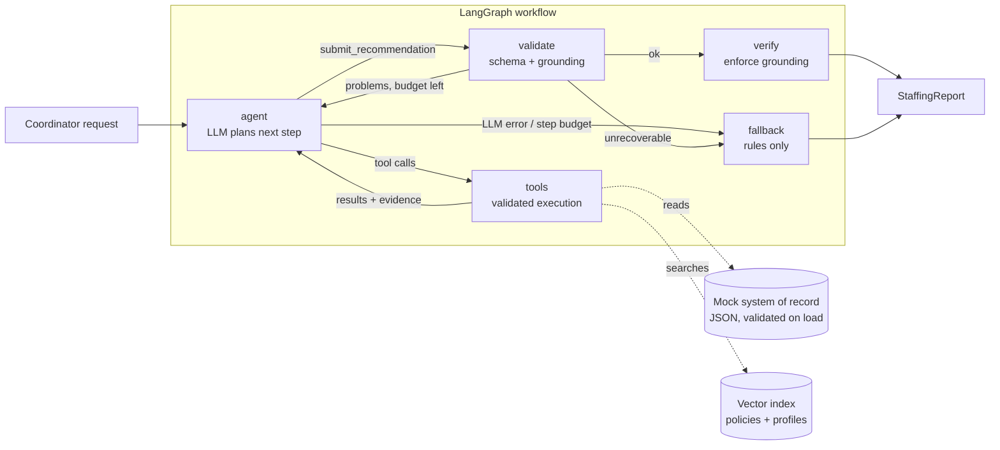

# Shift Fill Assistant

An AI workflow assistant for the operations team of a healthcare staffing platform. A coordinator
types a request such as *"Find two ICU nurses for the St. Mary's night shift on October 14 and draft outreach"*. The assistant then works through these steps:

1. Resolves the request to a concrete open shift, or asks a clarifying question.
2. Retrieves the facility's policies (RAG) to learn unit preferences and rules.
3. Finds candidate clinicians with semantic search over their profiles.
4. Vets every candidate with a deterministic compliance engine. The engine checks license, jurisdiction, certifications valid through the shift, experience, double-booking and rest time.
5. Ranks the eligible clinicians, explains each choice with citations, and drafts outreach for a human to review.
6. Verifies the answer against the evidence the tools returned before showing it.

> Senior AI Engineer take-home for Florence Healthcare, by
> [Aibek Rysbek](https://github.com/aibek-r).
> Stack: Python 3.11+, LangGraph, OpenAI (`gpt-5.4-mini`), fastembed, Pydantic, Streamlit.

## Quick start

```bash
python -m venv .venv
.venv\Scripts\activate            # macOS/Linux: source .venv/bin/activate
pip install -e ".[dev]"
cp .env.example .env              # then set OPENAI_API_KEY

streamlit run app/streamlit_app.py                     # web UI
shift-assistant "Find two ICU nurses for the St. Mary's night shift on Oct 14"   # CLI
pytest                                                 # 38 offline tests, no API key needed
```

The first run downloads a small local embedding model of about 70 MB into `.cache/`. Without an
API key, the app still runs in deterministic fallback mode.

Docker is optional:
`docker build -t shift-fill-assistant . && docker run -p 8501:8501 --env-file .env shift-fill-assistant`

## Architecture



| Layer | Module | Responsibility |
| --- | --- | --- |
| Domain | `domain/models.py`, `domain/eligibility.py` | Typed entities and the **deterministic compliance engine** |
| Data | `repository.py` | Loads and validates the JSON "system of record", including referential integrity |
| Retrieval | `retrieval/` | fastembed embeddings, a cosine vector index with metadata pre-filtering, policy chunking |
| Tools | `tools/` | Five tools with Pydantic argument schemas, plus a registry that never raises |
| Agent | `agent/` | LangGraph state machine, prompts, the structured submission schema |
| Reliability | `reliability/` | Grounding checker, verifier, deterministic fallback |
| Interfaces | `app/streamlit_app.py`, `cli.py` | Streamlit UI with live progress and a trace under Technical details, and a CLI that prints Markdown or JSON |

## How the requirements are met

| Requirement | Implementation |
| --- | --- |
| **Agent workflow** with multi-step reasoning, tool calling and context management | A LangGraph ReAct loop (`agent` and `tools` nodes) with typed state. The model chooses tools, with parallel calls allowed. The workflow ends only through a validated `submit_recommendation` tool call, enforced by `tool_choice="required"`. |
| **Tools** (at least 2 or 3) | `find_open_shifts`, `search_facility_policies`, `search_clinicians`, `evaluate_candidates` and `draft_outreach`, plus the submit tool. All data is mocked. |
| **Retrieval and context engineering** | **RAG** over facility handbooks, one chunk per `##` section, which gives stable citation IDs such as `FAC-001#icu-unit-profile`. **Embeddings and vector search** use local `bge-small` via fastembed. **Context filtering**: a facility only ever sees its own policies plus global ones, through a metadata pre-filter. **PII minimisation**: tools never expose emails, phone numbers or license numbers. **Memory and state**: an `EvidenceLedger` records every fact the tools returned in the run, and tool output is size-capped. |
| **Structured outputs** | The final answer is a Pydantic `AgentSubmission` passed as tool arguments. The public output is a typed `StaffingReport` with recommendations, alternates, exclusions with reason codes, candidate coverage counts, issues, trace and metrics. Code writes the summary from the verified lists, so counts never contradict them. |
| **Reliability** | See the next section. |

## Reliability and hallucination mitigation

The core principle is that **code decides facts and compliance, and the model decides judgement and
language**.

- **Deterministic compliance.** `EligibilityEngine` makes every eligibility verdict. The model
  cannot overrule it. `draft_outreach` refuses ineligible clinicians, and the verifier drops any
  ineligible clinician who reaches the answer.
- **Facts from the record.** Outreach drafts are templates filled from the record: facility,
  times with time zone, reply deadline and credential reminders. The LLM writes only a short
  personal note, and a validator rejects contact details or pay rates in it.
- **Grounding checks with self-repair.** On submission, `check_grounding` confirms that each
  item came from this run's evidence. The shift, every clinician (vetted and eligible), every
  citation and every draft must be there. It also confirms that every candidate the search
  returned was vetted. Problems go back to the model as a tool error, and it gets up to
  `MAX_REPAIR_ATTEMPTS` tries to fix them.
- **Enforcement.** If repairs run out, the verifier strips whatever is ungrounded and records each
  removal as an issue in the report. Names, warnings, citation text and drafts in the report always
  come from the ledger, never from model text.
- **Validation everywhere.** Data files, tool arguments, the submission and the request are all
  Pydantic models. Bad tool arguments, unknown IDs and malformed JSON become readable errors that
  the model can recover from. Unexpected tool exceptions are logged and contained without leaking
  internals.
- **Retries and fallback.** The OpenAI SDK retries 429s, 5xx errors and timeouts with
  exponential backoff. If the LLM still fails, is missing, or exceeds `MAX_AGENT_STEPS`, the
  graph routes to a **deterministic fallback**. It uses the same engine and templates and labels
  the report `mode: fallback`. The UI can simulate an outage to show this.
- **Prompt-injection hygiene.** The prompt says tool data is data, not instructions. One mock
  profile, Aisha Rahman, contains an injection attempt. She is ineligible anyway, and the verifier
  would drop her even if the model complied.
- **Auditability.** Every LLM call, tool call, validation and verification step is recorded as a
  trace event with its timing and tokens. The trace appears under Technical details in the UI and is saved in the report.

## Example workflows

These were generated by `python scripts/run_examples.py` against the live model. Each has a
readable `.md` and a full `.json` report.

| Example | Demonstrates | Result |
| --- | --- | --- |
| [01-icu-night-shift](examples/01-icu-night-shift.md) | Full ReAct loop, RAG citations, six exclusions with reason codes, an eligible alternate | `ready`. Maria Santos and Grace Liu recommended, Daniel Kim kept as an alternate |
| [02-picu-shortlist-with-warning](examples/02-picu-shortlist-with-warning.md) | Expiring-credential warning carried into the rationale and the outreach | `ready`, with Liam Chen's PALS flagged |
| [03-ambiguous-request](examples/03-ambiguous-request.md) | Clarification instead of guessing | `needs_clarification` |
| [04-unknown-facility](examples/04-unknown-facility.md) | Tool error turned into a helpful question | `needs_clarification` |
| [05-no-eligible-candidates](examples/05-no-eligible-candidates.md) | Honest "nobody qualifies" answer, with reasons | `no_eligible_candidates` |
| [06-llm-outage-fallback](examples/06-llm-outage-fallback.md) | Simulated LLM outage, rules-only report | `ready` (`mode: fallback`) |

A typical full run takes about 5 LLM calls, 14k tokens and 15 seconds. Hallucination repair and
enforcement cannot be triggered on demand with a live model, so they are shown by the scripted
tests below.

## Testing

`pytest` runs 38 tests offline in under a second. They use a hashing embedder and a scripted chat
model.

- **Eligibility.** Every blocker type, warnings, and the boundary where a credential expires on
  the shift's last day.
- **Retrieval.** Chunk IDs, ranking, and proof that a facility's search never returns another
  facility's policies.
- **Tools.** PII is never exposed. Errors are readable. Exceptions are contained. Outreach for
  ineligible clinicians and notes with pay rates are refused.
- **Workflow.** The happy path. A hallucinated candidate sent back for repair. Ungrounded content
  stripped once repairs run out. Incomplete vetting caught. An unparseable answer, an LLM outage,
  a missing key and a step-budget overrun all degrading to the fallback. Malformed tool-call JSON
  and an early submit reported back to the model.

`ruff check`, `ruff format --check` and `mypy --strict` all pass on `src/`.

## Configuration

All settings live in `config.py` and can be overridden through environment variables or `.env`.

| Variable | Default | Purpose |
| --- | --- | --- |
| `OPENAI_API_KEY` | none | Enables the agent. Without it, the fallback mode runs. |
| `OPENAI_MODEL` | `gpt-5.4-mini` | Any tool-calling OpenAI model |
| `OPENAI_REASONING_EFFORT` | `low` | Set `none` for non-reasoning models such as `gpt-4.1-mini` |
| `MAX_AGENT_STEPS` / `MAX_REPAIR_ATTEMPTS` | `12` / `2` | Loop budgets |
| `EXPIRY_WARNING_DAYS` | `30` | Window for the credential-expiring warning |
| `REFERENCE_DATE` | today | Pins "today". The mock shifts are in October 2026. |

## Mock data

The mock data lives in `data/`. It holds 3 facilities, 7 open shifts, 20 clinicians, 3 existing
bookings and 4 policy handbooks. Each clinician exercises a specific rule, for example:

- an ACLS certificate that expires before the shift
- a California-only license at a Texas facility
- a compact license at a facility that does not accept compact licenses
- a double booking
- too little rest between shifts
- an inactive profile
- a certificate expiring within 30 days, which is a warning rather than a blocker

## Trade-offs and next steps

- **The model's ranking varies a little between runs.** Compliance is deterministic, but ordering
  among eligible clinicians is the model's judgement. I tightened it with an explicit ranking
  rubric and the vetting-coverage check. Next I would build a golden-set evaluation harness that
  scores ranking agreement and grounding rate on every prompt or model change.
- **Scale.** The brute-force numpy index is fine for hundreds of chunks. At scale I would move to
  pgvector or a managed vector database, and use hybrid BM25 plus vector search.
- **Production hardening.** I would add real data sources behind the repository interface,
  persist the audit trace, and add OpenTelemetry or LangSmith tracing, authentication, rate
  limits, and a HIPAA and PII review of what reaches the LLM provider.
- **Conversation memory.** A LangGraph checkpointer would let a coordinator answer the
  clarifying question in the same thread.
- **Human in the loop.** The UI already lets a coordinator edit and approve each draft, but
  delivery is simulated. I would connect it to a real messaging channel and keep an audit record
  of who approved and sent what.
